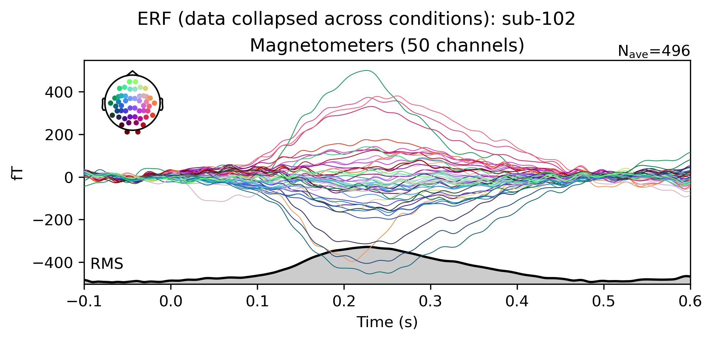
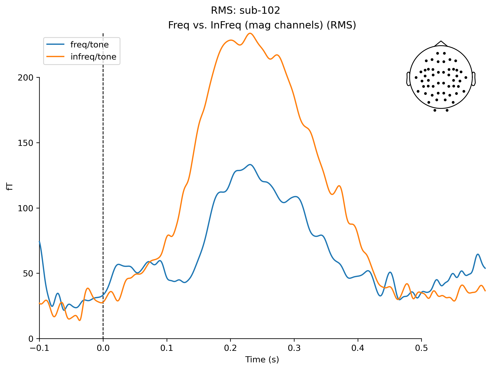

# babypyopm

** Note 24 July **: Data are currently being uploaded on RDS: `~/oriolig-babyopm/project_setup_methods/data/`

# Preliminaries

#### Important information about the infant helmet / sensor locations

+ Sensor locations for the FieldLine infant rigid helmet are not integrated in the .fif file at recording.
+ They are stored in a seperate .tsv in each participants' folders, path: /data/sub-{subj}/📄 sub-{subj}_referencechannels_location.json
+ Script `000_file_prep_infants_add_sensor_locations.py` adds sensor locations to the **_raw.fif** files (see below for more details).

# Current project structure

```text
📁 project_setup_methods_paper
├── 📁 data
│   ├── 📁 sub-001
│   │   ├── 📁 raw_recording
│   │   ├── 📁 raw_rotated_sensorlocations
│   │   ├── 📁 processed_filtered
│   │   ├── 📁 processed_filtered_ica
│   │   ├── 📁 processed_filtered_{operation}
│   │   ├── 📄 sub-001_notes_session.txt
│   │   ├── 📄 sub-001_badchannels.tsv
│   │   ├── 📄 sub-001_sensor_locations.tsv
│   │   ├── 📄 sub-001_event_dict.json
│   │   └── 📄 sub-001_referencechannels_location.json
│   ├── 📁 sub-002
│   ├── 📁 ...
│   └── 📁 sub-{subj}
├── 📁 montages
├── 📁 results
│   ├── 📁 psd
│   ├── 📁 preprocessing_routine_1
│   │   ├── 📁 erf
│   │   └── 📁 rms
│   │   └── 📄 sub-001_referencechannels_location.json
│   ├── 📁 preprocessing_routine_2
│   ├── 📁 ...
│   └── 📁 preprocessing_routine_{routine}
├── ➡️ ➡️ 📄 participant_log.csv
├── 📄 babyopm_testing_overview.csv
├── 💻 000_file_prep_infants_add_sensor_locations.py
├── 💻 001_simple_explore_psd_channels_noise.py
├── 💻 002_filtering.py
├── 💻 003_simple_explore_task.py 
├── 📝 utils_study.py
├── 📝 utils_infant_helmet.py
├── 📝 utils_preprocessing_analysis.py
└── {...}
```
## `montages`
contains image files of sensor motanges: 
  + 📄 `*.png` 2D sensor layout plots
  + 📄 `*.png` 3D sensor layout plots

🛠️ generated by: `000_file_prep_infants_add_sensor_locations.py`

## `results`

### `psd`
contains power spectral density (PSD) plots: 
  + 📄 `*.png` PSD plots from **task recordings**
  + 📄 `*.png` PSD plots from **emptyroom recordings**

🛠️ generated by: `001_simple_explore_psd_channels_noise.py`

### `preprocessing_routine_1`
contains results from preprocessing_routine_1:
1. bandpass filter .1-40 Hz
2. notch filter 50 Hz [`notch_filter(freqs=np.arange(50, 251, 50), notch_widths=5)`]
   
#### `erf`
contains erd plots:
  + *_erf_joint_freq.png
  + *_erf_joint_infreq.png
  + *_erf_joint_overall.png
  + *_erf_simple_overall.png
  + *_erf_topo_overall.png

🛠️ generated by: `003_simple_explore_task.py`

##### Examples



#### `rms`
contains rms plots

🛠️ generated by: `003_simple_explore_task.py`

##### Examples


# Scripts

## Prep & channel checks

`000_file_prep_infants_add_sensor_locations.py` - relevant only for the infant data

> [BELOW TO BE CONTINUED / EDITED]

*input files*:\
*output file(s)*: *_upright_raw.fif

1. adds sensor locations
2. rotates the helmet (from supine to upright position)
3. concatenantes two tasks into one .fif file (background: tone oddball data and syllable oddball data were stored in seperate files)


