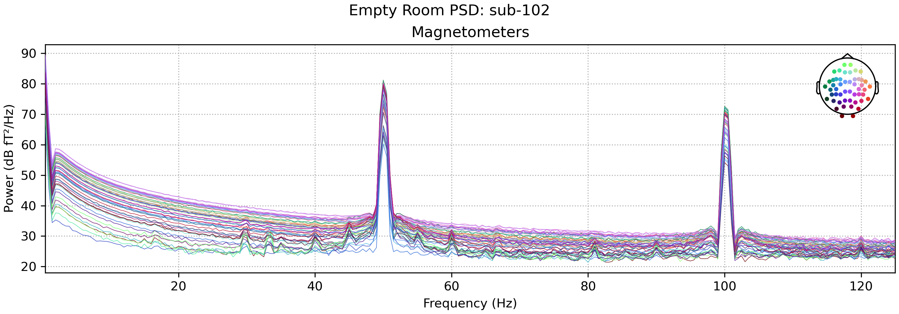
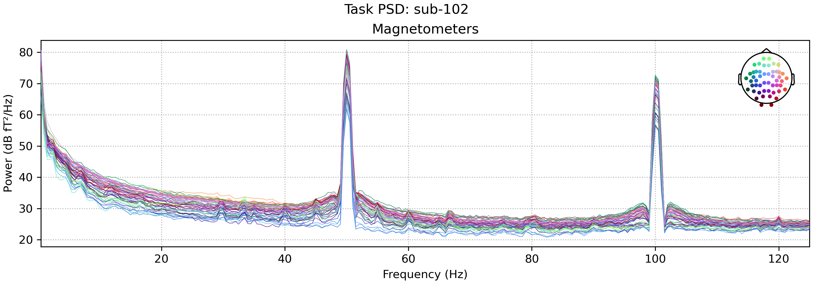
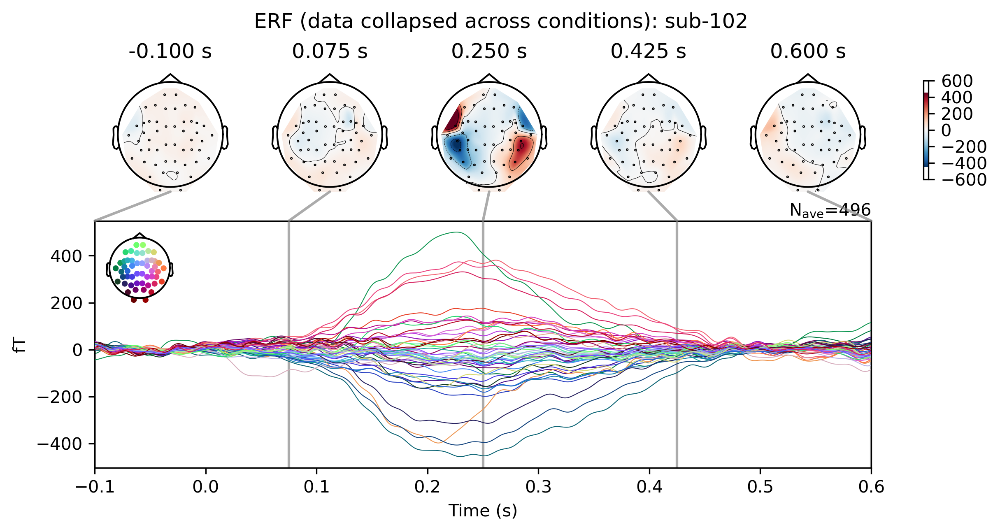
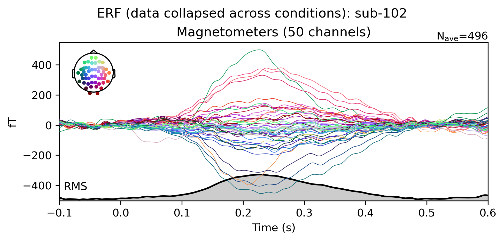
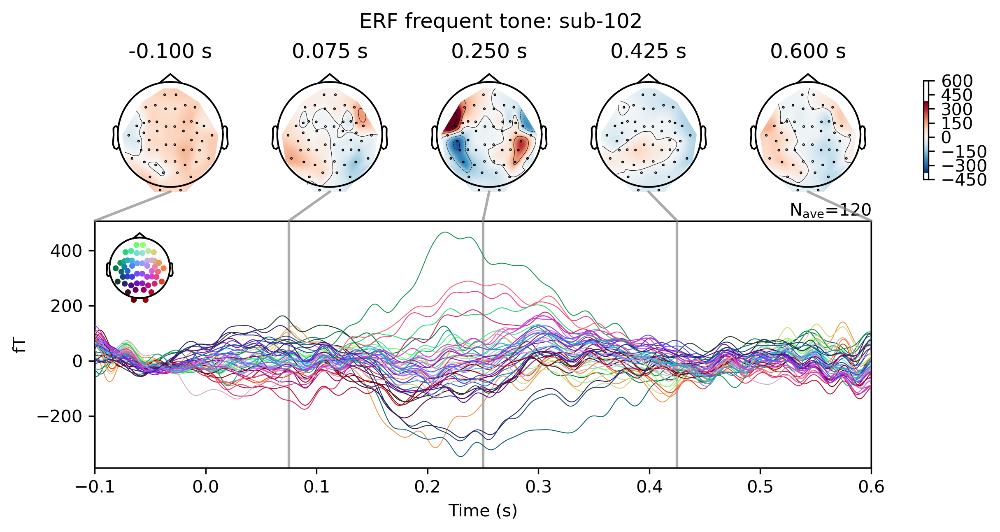
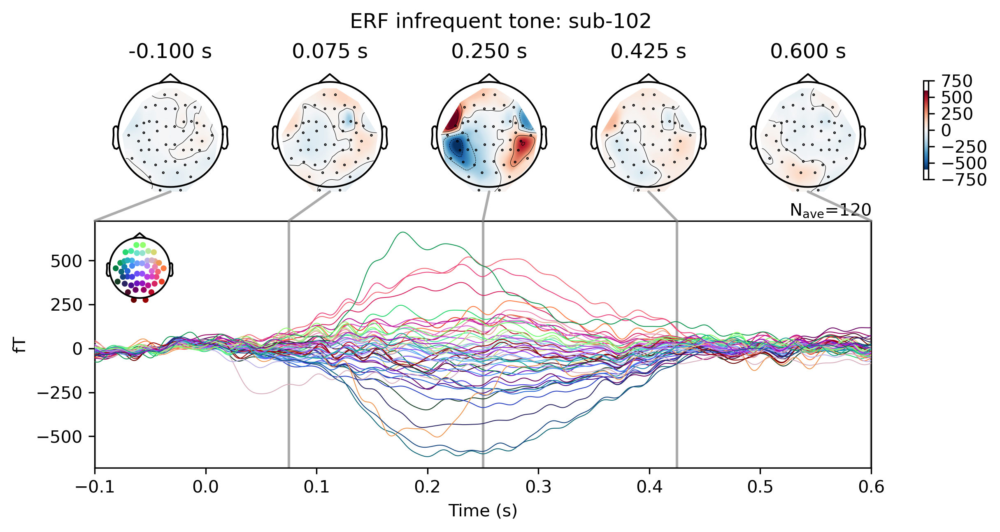
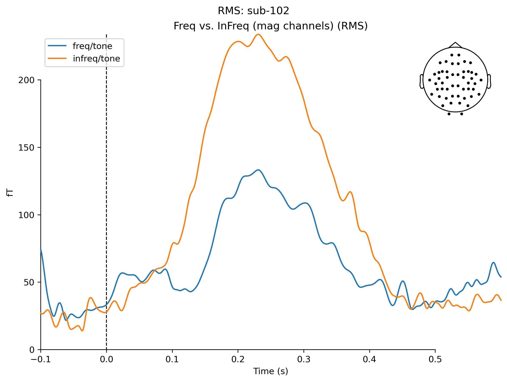

# babypyopm

# Repository info

This is a repository for Orioli*, G., Pesquita*, A.,..., Kowalczyk**, A., & Pomiechowska**, B. (under review). Kick-starting infant OPM-MEG: proof-of-concept platform, open-science protocols, analysis pipeline BabyPy_OPM, and auditory oddball data.

This repository comprises:
+ infant OPM-MEG analysis pipeline _BabyPY_OPM_
+ Supplmental materials 01 to 12 [https://github.com/bpomie/babypyopm/tree/main/supplemental_materials]

The data, raw and processed, are available on the project OSF repository: https://osf.io/43xap/overview

# Preliminaries

#### Important information about the infant helmet / sensor locations

+ Sensor locations for the FieldLine prototype infant helmet are not integrated in the .fif file at recording.
+ They are stored in seperate .tsv files for each participant, path: /data/sub-{subj}/📄 sub-{subj}_referencechannels_location.json
+ Script `000_simple_explore_layout.py` adds sensor locations to the **_raw.fif** files (see below and manuscript outline for more details).

# Current project structure

```text
📁 project_setup_methods_paper
├── 📁 data
│   ├── 📁 sub-001
│   │   ├── 📁 raw_recording
│   │   ├── 📁 raw_rotated_sensorlocations
│   │   ├── 📁 processed_1_filtered
│   │   ├── 📁 processed_2_filtered_ica
│   │   ├── 📁 processed_3_filtered_ica_manualclean
│   │   ├── 📄 sub-001_notes_session.txt
│   │   ├── 📄 sub-001_badchannels.tsv
│   │   ├── 📄 sub-001_sensor_locations.tsv
│   │   ├── 📄 sub-001_event_dict.json
│   │   └── 📄 sub-001_referencechannels_location.json
│   ├── 📁 sub-002
│   ├── 📁 ...
│   └── 📁 sub-{subj}
├── 📁 montages
├── 📁 results
│   ├── 📁 psd
│   ├── 📁 preprocessing_routine_1
│   │   ├── 📁 erf
│   │   └── 📁 rms
│   │   └── 📄 sub-001_referencechannels_location.json
│   ├── 📁 preprocessing_routine_2
│   ├── 📁 ...
│   └── 📁 preprocessing_routine_{routine}
├── ➡️ ➡️ 📄 participant_log.csv
├── 📄 babyopm_testing_overview.xlsx
├── 💻 000_simple_explore_layout.py
├── 💻 000_simple_explore_sensor_orientations.py
├── 💻 001_simple_explore_psd_channels_noise.py
├── 💻 002_group_filtering.py
├── 💻 003_group_ica.py
├── 💻 100_simple_explore_task.py 
├── 📝 utils_study.py
├── 📝 utils_preprocessing_analysis.py
└── {...}
```
# Scripts and files

NOTE: Be sure to specify your working directory in each script.

## Overview

### `simple_explore` scripts

`simple_explore` scripts are walkthroughs on single participants and use base MNE functions. Please see manuscript outline for more details and tasks.

### `group` scripts

`group` scripts loop through all subjects in the data folder. They use utils_* pipelines. Please see manuscript outline for more details and tasks.

### input & output `files` for each script

1.	Files generated automatically during recording
(path: '~/data/sub-{nnn}/raw_recording/')
-	'sub-{nnn}_channels.tsv'
-	'sub-{nnn}_raw.fif'

2.	Files generated during/after recording with manual experimenter input
(path: '~/data/sub-{nnn}/')
-	`sub-{nnn}_badchannels.tsv`
-	`sub-{nnn}_sensor_locations.tsv`
-	`sub-{nnn}_{sub-}_event_dict.json`
-	`sub-{nnn}_referencechannels_location.json`


## `montages`
contains image files of sensor motanges: 
  + 📄 `*.png` 2D sensor layout plots
  + 📄 `*.png` 3D sensor layout plots
  + + 📄 `*.png` 3D sensor layout plots with sensor orientations

🛠️ generated by: `000_file_prep_infants_add_sensor_locations.py`

## `results`

### `psd`
contains power spectral density (PSD) plots: 
  + 📄 `*.png` PSD plots from **task recordings**
  + 📄 `*.png` PSD plots from **emptyroom recordings**

🛠️ generated by: `001_simple_explore_psd_channels_noise.py`

##### Examples




### `preprocessing_routine_1`
contains results from preprocessing_routine_1:
1. bandpass filter .1-40 Hz
2. notch filter 50 Hz [`notch_filter(freqs=np.arange(50, 251, 50), notch_widths=5)`]
   
#### `erf`
contains erd plots:
  + *_erf_joint_freq.png
  + *_erf_joint_infreq.png
  + *_erf_joint_overall.png
  + *_erf_simple_overall.png
  + *_erf_topo_overall.png

🛠️ generated by: `003_simple_explore_task.py`

##### Examples





#### `rms`
contains rms plots

🛠️ generated by: `003_simple_explore_task.py`

##### Examples



